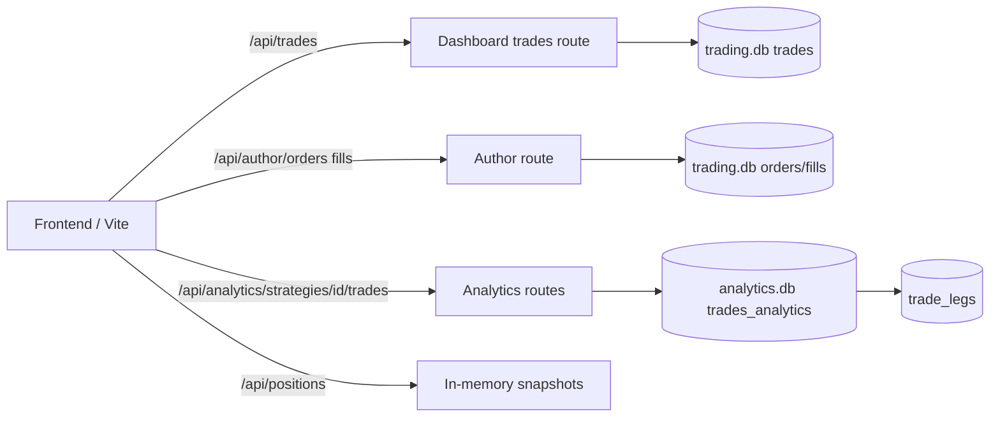

# API ↔ Store Mapping Diagram

```mermaid
flowchart LR
    FE[Frontend / Vite] -->|/api/trades| TDAPI[Dashboard trades route]
    FE -->|/api/author/orders fills| AUTH[Author route]
    FE -->|/api/analytics/strategies/id/trades| AN[Analytics routes]
    FE -->|/api/positions| MEM[In-memory snapshots]
    TDAPI --> TD[(trading.db trades)]
    AUTH --> TD2[(trading.db orders/fills)]
    AN --> AD[(analytics.db trades_analytics)]
    AD --> ADL[(trade_legs)]
```