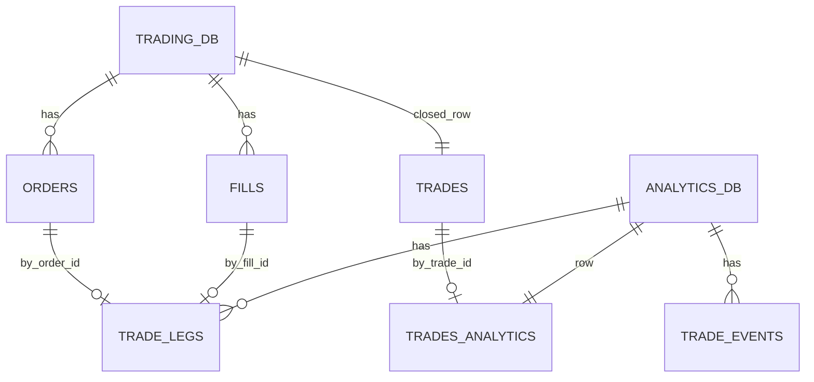

# Data Consistency Flow (SQL)

```mermaid
erDiagram
    TRADING_DB ||--o{ FILLS : has
    TRADING_DB ||--o{ ORDERS : has
    TRADING_DB ||--|| TRADES : closed_row
    ANALYTICS_DB ||--o{ TRADE_LEGS : has
    ANALYTICS_DB ||--o{ TRADE_EVENTS : has
    ANALYTICS_DB ||--|| TRADES_ANALYTICS : row
    TRADES ||--o| TRADES_ANALYTICS : by_trade_id
    FILLS ||--o| TRADE_LEGS : by_fill_id
    ORDERS ||--o| TRADE_LEGS : by_order_id
```