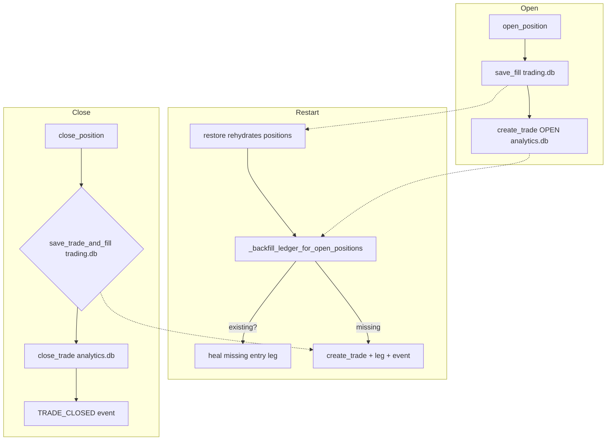

# Fix / Flow Diagram (fixed code paths)

```mermaid
flowchart TD
    subgraph Open
        A[open_position] --> B[save_fill trading.db]
        B --> C[create_trade OPEN analytics.db]
    end
    subgraph Restart
        R[restore rehydrates positions] --> BF[_backfill_ledger_for_open_positions]
        BF -->|existing?| H[heal missing entry leg]
        BF -->|missing| X[create_trade + leg + event]
    end
    subgraph Close
        Y[close_position] --> Z{save_trade_and_fill trading.db}
        Z --> W[close_trade analytics.db]
        W --> M[TRADE_CLOSED event]
    end
    B -.-> R
    C -.-> BF
    Z -.-> X
```