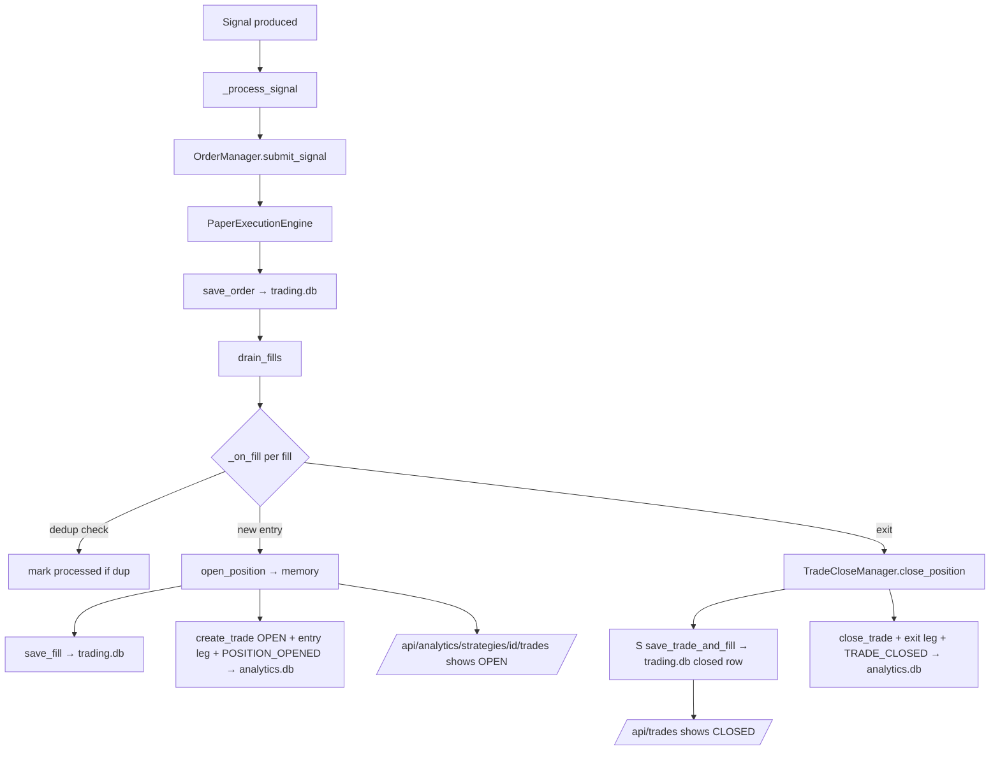

# Trade Lifecycle Diagram (Mermaid)

```mermaid
flowchart TD
    S[Signal produced] --> P[_process_signal]
    P --> O[OrderManager.submit_signal]
    O --> PE[PaperExecutionEngine]
    PE --> SO[save_order → trading.db]
    SO --> D[drain_fills]
    D --> F{_on_fill per fill}
    F -->|dedup check| FF[mark processed if dup]
    F -->|new entry| E[open_position → memory]
    E --> SF[save_fill → trading.db]
    E --> CT[create_trade OPEN + entry leg + POSITION_OPENED → analytics.db]
    F -->|exit| CL[TradeCloseManager.close_position]
    CL --> T[S save_trade_and_fill → trading.db closed row]
    CL --> TC[close_trade + exit leg + TRADE_CLOSED → analytics.db]
    E --> API1[/api/analytics/strategies/id/trades shows OPEN/]
    T --> API2[/api/trades shows CLOSED/]
```